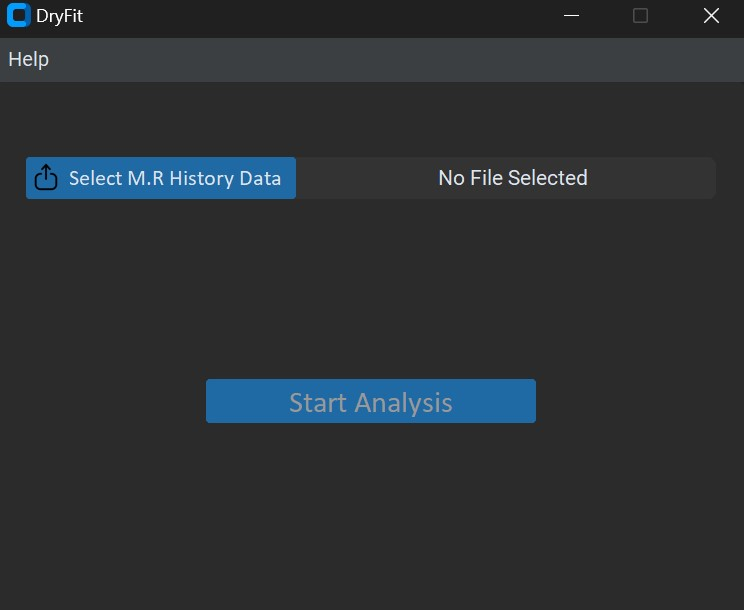

# 📦 Dryfit

**Dryfit** is a research-based desktop appliciation developed to analyze moisture ratio history data from the dehydration of agro-products. It offers tools to fit several thin-layer drying models to M.R history data, evaluates the goodness of fit of each model, moisture diffusivity computation, and visualization amongst many others to support post-harvest technology and food processing research.

---

## 🗂 Table of Contents

- [System Requirements](#system-requirements)  
- [Features](#features)
- [Installation](#installation)
- [Data Format](#usage)
- [Usage](#usage)  
- [Screenshots](#screenshots)  
- [Thin Layer Drying Models Supported](#thin-layer-drying-models-supported)
- [Project Structure](#project-structure)  
- [Contributing](#contributing)  
- [License](#license)  
- [Acknowledgements](#acknowledgements)

---
## 💻 System Requirements
- **Operating System:** Windows 7 or higher  
- **Python (for developers):** 3.13.0 or later  
- **Dependencies (for developers):**
  - numpy  
  - pandas  
  - scipy  
  - matplotlib  
  - customtkinter  
  - openpyxl
---

## ✨ Features

- Load and analyze moisture ratio history data from Excel file
- Calculate moisture diffusivity.
- Calculate thermodynamic properties (Enthalpy, Entropy and Gibbs Free Energy) 
- Fit multiple thin-layer drying models using Non-linear regression (e.g., Page, Henderson and Pabis, Logarithmic).    
- Calculate statistical parameters (R², RMSE, SSE).
- Use the statictical parameters to determine the best model.
- Use the best model to predict moisture ratio from time.
- Generate data for drying, drying rate and krischer plots.
- Create visual plots of the data generated.
- Export analysis results and plots.  
- User-friendly GUI (Tkinter & CustomTkinter).

---

## ⚙️ Installation

DryFit can be run in two ways:
### 🔹 Option 1: Using Python (for developers or researchers with Python installed)
1. **Clone the repository:**
   ```bash
     git clone https://github.com/mazi-kunle/DRYING-SOFTWARE.git
     cd DRYING-SOFTWARE
   ```
2. **Install dependencies:**
   ```bash
    pip install -r requirements.txt
   ```
4. **Run the application:**
   ```bash
    python app.py
   ```
### 🔹 Option 2: Windows Executable Installation (for End Users)

DryFit can be installed like a regular Windows desktop application — **no need to install Python or run any scripts**.

#### 🧾 Steps:

1. Download the installer from the [Releases](https://github.com/yourusername/dryfit/releases) page  
   (e.g., `DryFit_Setup.exe`).
2. Double-click the downloaded file to run the installer.
3. Follow the on-screen instructions to complete installation.
4. After installation:
   - Launch the app from the **Start Menu**
   - Or use the **Desktop shortcut** (if selected during setup)

✅ **Note:** This version is built using [PyInstaller](https://www.pyinstaller.org/) and includes all required dependencies bundled within the executable.

#### 💡 System Requirements:

- **Operating System:** Windows 10 or higher (64-bit)
- **Disk Space:** ~100MB (depends on packaging)
- **Permissions:** Administrator access may be required for installation

> This option is recommended for non-technical users or when sharing the app with field researchers and practitioners.

---
## 📂 Data Format

**Input data:** DryFit only accepts excel files (`.xlsx`) with the following structure.
  
| Temperature (Celcius)| Thickness (mm)| Time (min) | Moisture Ratio |
|----------------------|---------------|------------|----------------|
| 60                   | 1.5           | 0          | 1.000          |
|                      |               | 10         | 0.850          |
|                      |               | 20         | 0.700          |
|                      |               | ...        | ...            |

**Requirements:**
  - Each dataset for a particular experiment should be placed in several sheets in one excel file.
  - The excel sheet must contain only 4 columns.
  - The first column must contain only one temperature value in degree Celcius.
  - The second column must contain only one thickness value in mm.
  - The third column can have several time values in minutes.
  - The last column can have several M.R values (Dry Basis).

**Output data:** Results are stored in a folder which includes an excel file containing the calculated data in several sheets and the required plots in `jpeg` format.

---

## 🚀 Usage

From the GUI:
1. Click the **select...** button to upload your M.R history data file.  
2. Click **Start Analysis**.
3. After some time, a success or error message will be displayed. 
4. View results in the results folder created.  
5. in the case of an error message, click the help button, read the documentation and format the input sheet accordingly.

---

## 🖼 Screenshots


---

## 📊 Thin Layer Drying Models
DryFit supports the following mathematical models
 
| S/N | Model Name                 | Equation                                             |
|-----|----------------------------|------------------------------------------------------|
| 1   | Modified Henderson & Pabis | MR = a\*exp(-k\*x) + b\*exp(-g\*x) + c\*exp(-h\*x)   |
| 2   | Henderson & Pabis          | MR = a\*exp(-k\*(x^n))                               |
| 3   | Weibull                    | MR = (a-b)\*(exp(-k\*(x^n)))                         |
| 4   | Page                       | MR = exp(-k\*(x^n))                                  |
| 5   | Modified Page              | MR = exp(-(k\*(x^n)))                                |  
| 6   | Haghi & Ghanadzadeh        | MR = a\*exp(-b\*(x^c)) + (d\*(x^2)) + (e\*x) + f     |
| 7   | Verma et al                | MR = a\*exp(-k\*t) + ((1-a)\*exp(-g\*x))             |
| 8   | Midilli et al              | MR = a\*exp(-k\*x) + (b\*x)                          |
| 9   | Peleg                      | MR = 1 - (x / (a+(b\*x)))                            |
| 10  | Newton                     | MR = exp(-k\*x)                                      |
| 11  | Logarithmic                | MR = a\*exp(-k\*t) + c                               |
| 12  | Silva et al                | MR = exp(-a\*x - b\*sqrt(x))                         |
| 13  | Wang and Singh             | MR = 1 + a\*t + b\*t^2                               |
| 14  | Two-term                   | MR = a\*exp(-k\*t) + b\*exp(-g\*t)                   |
| 15  | Demir et al                | MR = a\*exp(-k\*t)^n + b                             |
| 16  | Hill et al                 | MR = a\*exp(-k\*t^n) + b\*exp(-g\*t^n)               |

---

## 🙌 Acknowledgements

Special thanks to the following individuals and resources that contributed to the development of DryFit:

- Professor Akinjide. A. Akinola — for academic guidance and support.
- The Department of Chemical Engineering, University Of Lagos.
- Python community and open-source libraries:
  - SciPy
  - pandas
  - matplotlib
  - customtkinter
- Fellow researchers who tested early versions of the software

---

## 👤 Credits

**Developer:** Olakunle Micheal Olorunfemi
**Supervisor:** Professor Akinjide. A. Akinola
**Institution:** University Of Lagos
**Department:** Chemical Engineering 
**Project Title:** Development of a Computer Software for Analysis of Data from Agro-Products Dehydration  
**Date:** July 2025

## 📬 Contact Us

Have questions, feedback, or suggestions?

You can reach out via:

- 📧 Email: 180401040@live.unilag.edu.ng
- 🏫 Institution: Chemical Engineering, University of Lagos
- 📍 Location: Nigeria

If you encounter issues with the software, please report them through the [GitHub Issues](https://github.com/yourusername/dryfit/issues) page.


